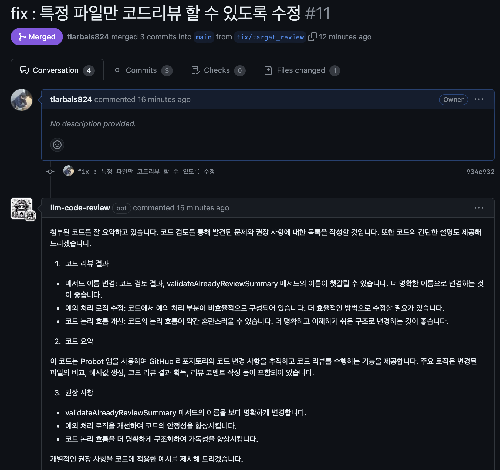
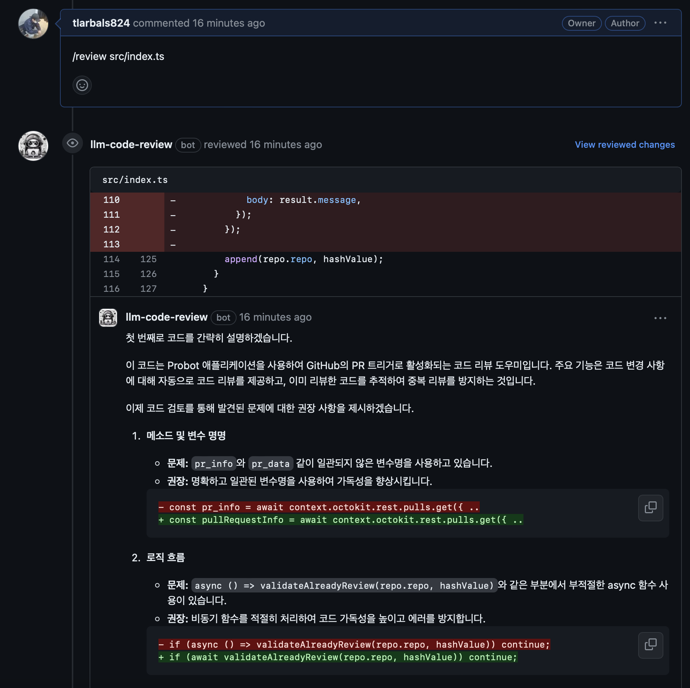

# code-review-app


## 개요

* Pull Request를 올리면 코드리뷰해주는 Github App 입니다!

 

## 사용 방법

* 기본적으로 pr을 올리면 올린 모든 내용에 대해서 요약을 진행해줍니다.
* 추가적으로 특정 파일에 대해서만 코드리뷰를 진행하고 싶다면 pr 코멘트에 ```/review``` 커맨드를 통해 코드 리뷰를 진행할 수 있습니다.
```
/review [file_name],[file_name],...
```
 


## 주의사항

* 기본적으로 같은 파일 내용에 대해서 2번 이상의 코드리뷰는 제한되어 있습니다. 자세한 제한 사항은 다음과 같습니다.
    * 똑같은 PR 내용에 대해서 제한
    * 똑같은 파일 내용에 대해서 제한


## 제안하기

* 코드 수정사항이나, 관련 불편 사항들은 이슈에 등록해주시면 감사하겠습니다!


